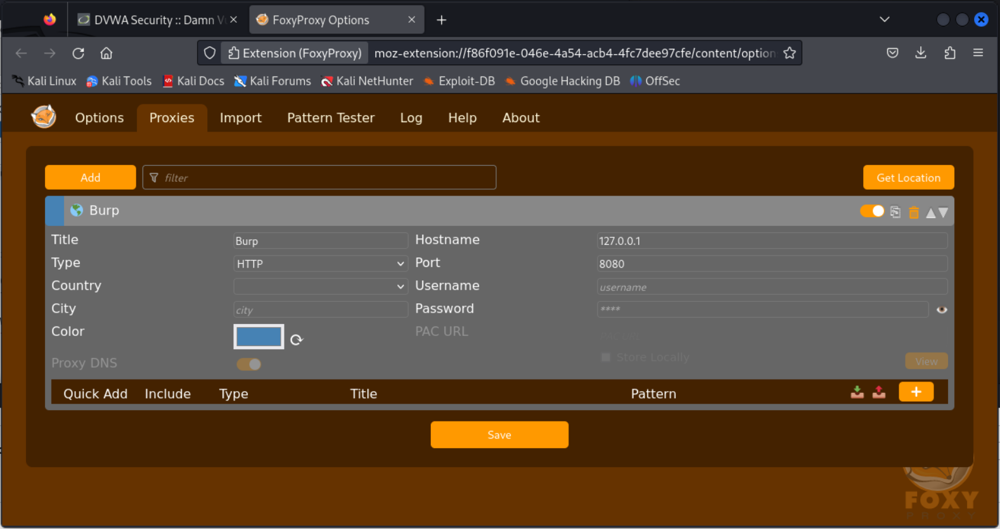

# Report sull'Analisi di Sicurezza: Brute Force Attack e SQL Injection

## Introduzione
Questo report presenta un'analisi dettagliata di due comuni strumenti d'attacco informatico: la Brute Force Attack e la SQL Injection. Durante l'analisi, verranno eseguite diverse attività utilizzando gli strumenti Burp Suite e DVWA su Kali Linux. Inoltre, sarà implementata l'estensione FoxyProxy su Firefox per scopi specifici durante il test.

## Descrizione delle Attività

### Attività 1: Preparazione dell'Ambiente di Test
1. Configurare un ambiente di test utilizzando una macchina virtuale Kali Linux.
2. Installare e configurare Burp Suite per il controllo del traffico.
3. Installare DVWA come web application di prova per simulare vulnerabilità.
4. Configurare FoxyProxy su Firefox per reindirizzare il traffico attraverso Burp Suite. 

### Attività 2: Brute Force Attack
1. Avviare DVWA e selezionare la modalità di sicurezza "low" per facilitare l'attacco.
2. Utilizzare Burp Suite per monitorare il traffico web durante l'attacco.
3. Utilizzare un tool di Brute Force (ad esempio Hydra) per tentare di indovinare la password di accesso a un account utente su DVWA.
4. Analizzare il traffico con Burp Suite per identificare i tentativi di accesso non autorizzati e le possibili vulnerabilità nel sistema.

### Attività 3: SQL Injection
1. Avviare DVWA e selezionare la modalità di sicurezza "medium" per simulare una vulnerabilità di SQL Injection.
2. Utilizzare Burp Suite per monitorare il traffico web durante l'attacco.
3. Utilizzare manualmente o uno strumento automatico per eseguire un attacco di SQL Injection contro un'applicazione web su DVWA.
4. Analizzare il traffico con Burp Suite per identificare i tentativi di iniezione SQL e valutare l'impatto sugli schemi di database.

## Conclusioni
Questo report ha fornito un'analisi dettagliata delle attività eseguite durante il test di Brute Force Attack e SQL Injection utilizzando Burp Suite, DVWA e FoxyProxy su Kali Linux. Le attività svolte hanno permesso di identificare vulnerabilità potenziali nel sistema e di valutare la sua resistenza agli attacchi comuni.

## Fonti Utilizzate
Le informazioni e le tecniche utilizzate in questo report sono state acquisite attraverso una combinazione di esperienza pratica, ricerca online e studio delle migliori pratiche di sicurezza informatica. Le fonti di riferimento includono documentazione ufficiale di Burp Suite, risorse online sulla sicurezza informatica e guide di formazione su DVWA e altri strumenti di test della sicurezza.
