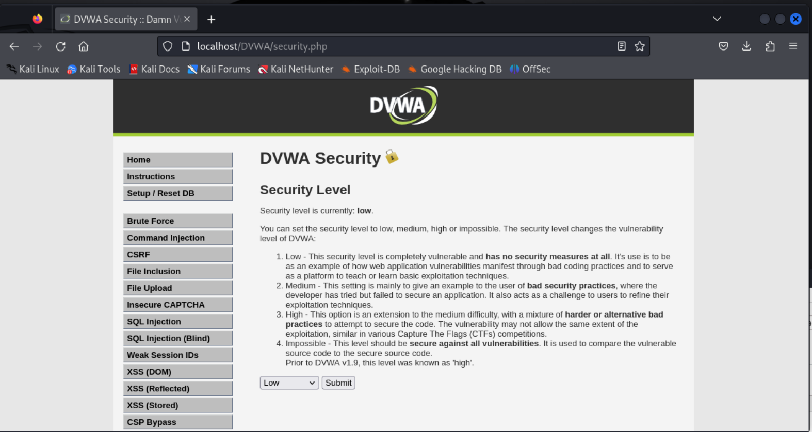

# Report sull'Analisi di Sicurezza: Brute Force Attack e SQL Injection

## Introduzione
Questo report presenta un'analisi dettagliata di due comuni tecniche di attacco informatico: il Brute Force Attack e la SQL Injection. Le attività descritte sono state eseguite utilizzando Burp Suite e DVWA su Kali Linux. Inoltre, è stato utilizzato l'add-on FoxyProxy su Firefox per facilitare il controllo del traffico.

## Metodi di Attacco

### Brute Force Attack

Il Brute Force Attack è un metodo che consiste nell'effettuare una serie di tentativi di accesso utilizzando diverse combinazioni di username e password fino a trovare quelle corrette. Questo approccio si basa sull'idea che, anche se una password è complessa, esiste sempre la possibilità di indovinarla attraverso un numero sufficientemente grande di tentativi.
Per proteggere le applicazioni web da attacchi di tipo Brute Force, è fondamentale implementare misure di sicurezza come:
- Limitare il numero di tentativi di accesso consentiti entro un determinato periodo di tempo.
- Utilizzare politiche di password robuste che includano lunghezza minima, complessità e rotazione periodica delle password.
- Implementare il rilevamento e il blocco automatico degli indirizzi IP che tentano di eseguire un numero eccessivo di tentativi di accesso.
- Monitorare attivamente i tentativi di accesso sospetti e le attività anomale dei utenti.

### SQL Injection

La SQL Injection è una vulnerabilità che consente agli attaccanti di inserire comandi SQL dannosi all'interno delle query di input di un'applicazione web. Questi comandi possono manipolare il database sottostante, consentendo agli attaccanti di estrarre, modificare o eliminare dati, ottenere accesso amministrativo o eseguire altre azioni dannose.
Per mitigare il rischio di attacchi di tipo SQL Injection, è consigliabile adottare le seguenti best practice:
- Utilizzare le query parametrizzate o i prepared statement per eseguire operazioni di database.
- Validare e sanificare sempre i dati di input dell'utente prima di utilizzarli in query SQL.
- Limitare i privilegi dell'account di accesso al database, garantendo che l'applicazione web utilizzi un account con i minimi privilegi necessari per le operazioni richieste.
- Implementare controlli di accesso basati su ruoli per garantire che gli utenti possano accedere solo alle risorse autorizzate.

### Importanza dell'Analisi e del Test delle Vulnerabilità

La comprensione e l'analisi approfondita di queste tecniche di attacco sono cruciali per garantire la sicurezza delle applicazioni web. Testare regolarmente le vulnerabilità attraverso strumenti come Burp Suite e DVWA permette di identificare e correggere le falle di sicurezza prima che possano essere sfruttate dagli attaccanti.
L'analisi dei rischi è un processo fondamentale per identificare, valutare e mitigare le potenziali minacce alla sicurezza delle applicazioni web. Attraverso l'analisi dei rischi, le organizzazioni possono identificare le vulnerabilità esistenti, valutarne l'impatto potenziale e pianificare le contromisure appropriate per mitigare o eliminare i rischi identificati.

## Strumenti Utilizzati

### Kali Linux
Kali Linux è una distribuzione di Linux specializzata per la sicurezza informatica e i test di penetrazione. È fornita di numerosi strumenti per l'analisi delle vulnerabilità, tra cui Burp Suite e SQLmap.

### Burp Suite
Burp Suite è una piattaforma per il test della sicurezza delle applicazioni web, utilizzata per intercettare, analizzare e testare le vulnerabilità dei siti web. Fornisce strumenti per l'intercettazione delle richieste HTTP, il rilevamento delle vulnerabilità e l'esecuzione di attacchi come brute force e SQL injection.

### DVWA (Damn Vulnerable Web Application)
DVWA è un'applicazione web progettata per essere vulnerabile a vari attacchi informatici. Utilizzata come strumento didattico per insegnare best practice di sicurezza informatica e praticare penetration testing in un ambiente controllato.
Principali caratteristiche:
- **Livelli di Sicurezza Configurabili**: Permette di regolare il livello di sicurezza per testare diverse vulnerabilità.
- **Vulnerabilità Simulate**: Include vulnerabilità simulate come SQL Injection e Cross-Site Scripting.
- **Ambiente di Laboratorio Sicuro**: È progettato per essere eseguito in un ambiente controllato, separato dalla produzione.

### FoxyProxy
FoxyProxy è un'estensione per Firefox che semplifica la gestione dei proxy e il routing del traffico web attraverso strumenti di sicurezza come Burp Suite.
Principali caratteristiche:
- **Configurazione Semplice dei Proxy**: Facilita la configurazione dei proxy nel browser.
- **Gestione Flessibile dei Proxy**: Supporta varie configurazioni proxy come HTTP, HTTPS e SOCKS.
- **Integrazione con Strumenti di Sicurezza**: Comunemente usato con strumenti di testing come Burp Suite per analizzare il traffico web durante il penetration testing.

## Descrizione delle Attività

### Preparazione dell'Ambiente
1. **Configurazione di DVWA**: Avviare DVWA e impostare il livello di sicurezza su "low" per facilitare l'attacco brute force e su "low" per la SQL Injection. 
2. **Configurazione di Burp Suite**: Avviare Burp Suite, creare un progetto temporaneo e accedere alla scheda "Proxy".
3. **Configurazione di FoxyProxy**: Configurare Firefox per utilizzare Burp come proxy. Se si utilizza FoxyProxy, selezionare semplicemente l'opzione "Burp". 

### Esecuzione dell'Attacco Brute Force

1. **Accesso a DVWA**: Accedere alla scheda "Brute Force" su DVWA e tentare un login con credenziali errate. Questo genererà un errore "username and password incorrect".
2. **Intercettazione della Richiesta**: Con l'intercettazione attivata su Burp Suite, inviare la richiesta di login da Firefox con credenziali corrette. Burp catturerà la richiesta. 
3. **Invio a Intruder**: In Burp Suite, cliccare su "Action" e poi su "Send to Intruder". Nella scheda "Positions", rimuovere tutti i target e selezionare il campo della password come target.
4. **Configurazione dei Payloads**: Nella scheda "Payloads", caricare una lista di parole. In questo esempio, si utilizza una lista chiamata `bruteforce.lst`.
5. **Avvio dell'Attacco**: Avviare l'attacco. Burp Suite inizierà a tentare diverse password.
6. **Analisi dei Risultati**: Ordinare le risposte per dimensione della lunghezza nella scheda "Length". La risposta con una lunghezza diversa indica la password corretta.
7. **Verifica della Password**: Verificare la risposta nella scheda "Response" per confermare l'accesso riuscito. 

### Esecuzione dell'Attacco SQL Injection

1. **Accesso a DVWA**: Accedere alla scheda "SQL Injection" su DVWA. Inserire il comando `' OR 1=1 #` nel campo ID per ottenere tutte le voci del database. 
2. **Intercettazione della Richiesta**: Con l'intercettazione attivata su Burp Suite, inviare una richiesta SQL Injection. La richiesta sarà catturata da Burp. 
3. **Salvataggio della Richiesta**: Salvare la richiesta intercettata in un file di testo (`request.txt`).
4. **Utilizzo di SQLmap**: Utilizzare il terminal di Kali Linux per automatizzare l'attacco SQL Injection con il comando: `sqlmap -h`.
5. **Estrazione dati**:
   - Per ottenere informazioni sul database DVWA utilizzare comando: `sqlmap -r request.txt --dbs`.
   - Per ottenere informazioni sulle tabelle utilizzare comando: `sqlmap -r request.txt -D dvwa -T users --columns`.
   - Per ottenere il dump dei dati utilizzare comando: `sqlmap -r request.txt -D dvwa -T users --dump-all`.
   

6. **Decifrazione degli Hash**: Durante il processo di estrazione dei dati, SQLmap potrebbe chiedere se si desidera decifrare gli hash delle password. Se si sceglie di farlo, SQLmap tenterà di decifrare gli hash utilizzando un dizionario predefinito.

### Conclusioni

Questo report ha descritto in dettaglio le attività eseguite per testare le vulnerabilità delle applicazioni web utilizzando brute force attack e SQL Injection. Utilizzando Burp Suite e DVWA su Kali Linux, è stato possibile identificare e sfruttare diverse vulnerabilità. Le tecniche illustrate evidenziano l'importanza di implementare misure di sicurezza robuste per proteggere le applicazioni web dagli attacchi comuni.

## Fonti Utilizzate
Le informazioni e le tecniche utilizzate in questo report sono state acquisite attraverso una combinazione di esperienza pratica, ricerca online e studio delle migliori pratiche di sicurezza informatica. Le fonti di riferimento includono:
- [Documentazione ufficiale di Burp Suite](https://portswigger.net/burp/documentation)
- [Guida di utilizzo di DVWA](http://www.dvwa.co.uk/)
- [Documentazione di SQLmap](https://sqlmap.org/)

